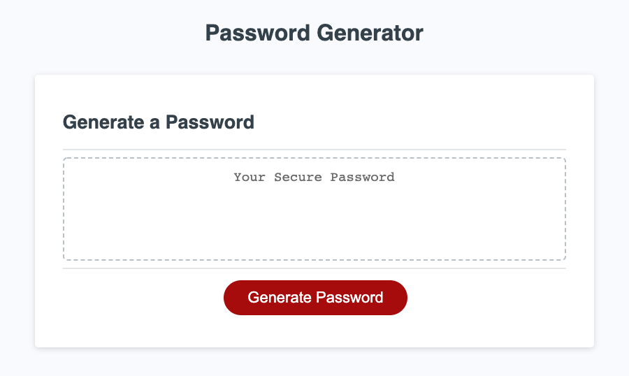

# passwordGenerator

## purpose

This password generator allows user to generate a random password between 8 and 128 characters.  The user can also select which criteria to include for password characters.   

## Preview

## Website
URL:  https://robert-schwartz.github.io/passwordGenerator/

GitHub Repository: https://github.com/Robert-Schwartz/passwordGenerator

## User Instructions

1.  Run the application is a Web Browser.
2.  When prompted: 
    1. Enter a password length as a number between 8 and 128.
    2. Confirm by clicking 'Okay' to include lowercase characters, or hit 'Cancel' to move to next character type.
    3. Confirm by clicking 'Okay' to include uppercase characters, or hit 'Cancel' to move to next character type.
    4. Confirm by clicking 'Okay' to include number characters, or hit 'Cancel' to move to next character type.
    5. Confirm by clicking 'Okay' to include special characters, or hit 'Cancel' to move to next character type.

3. View new randomly generated password

## Languages USED
This uses HTML, CSS, and JavaScript
